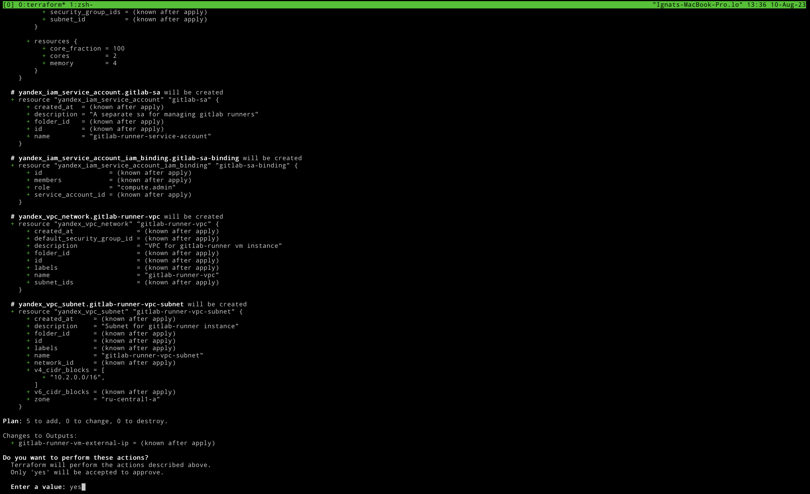
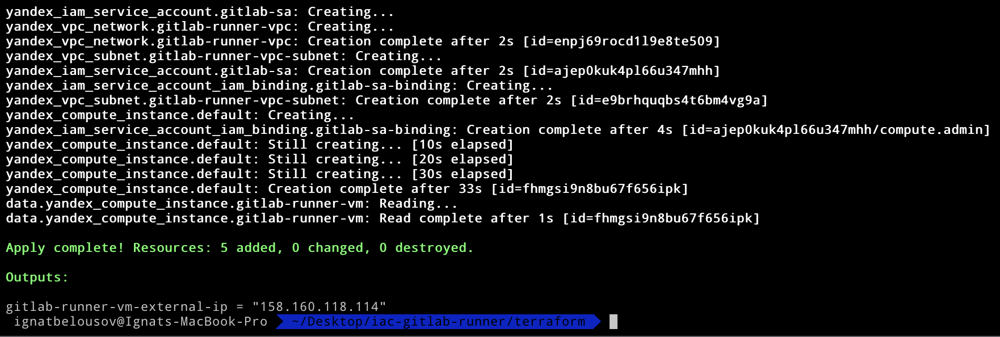
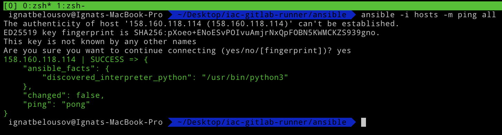
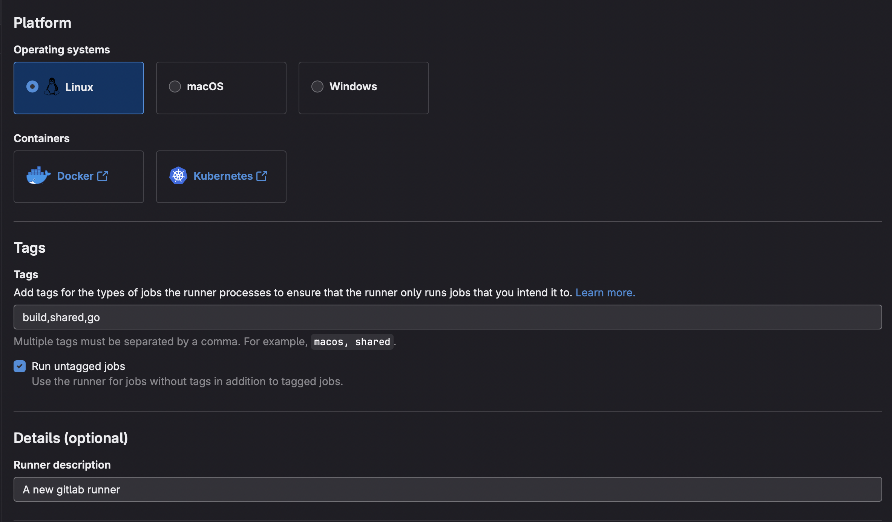
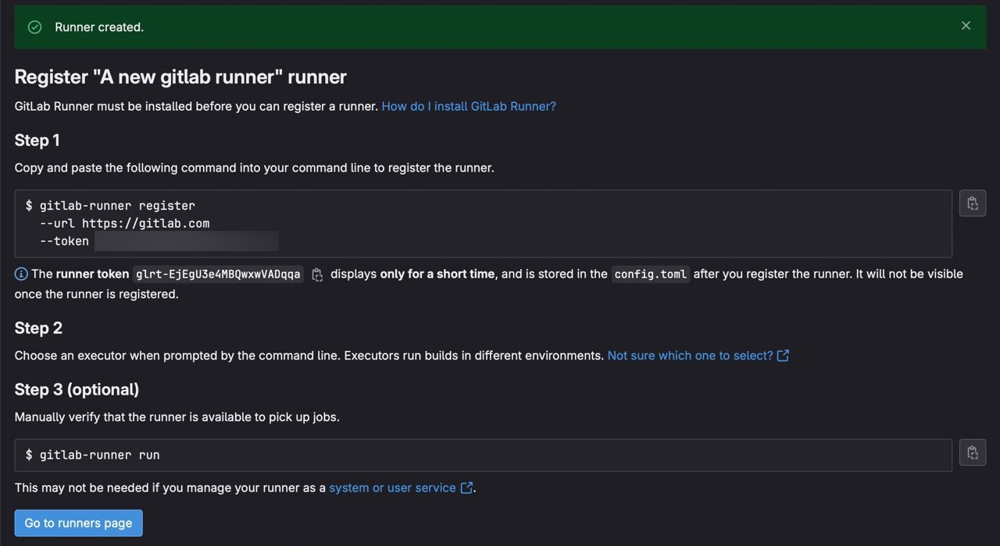
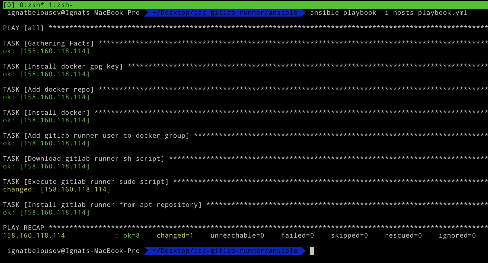
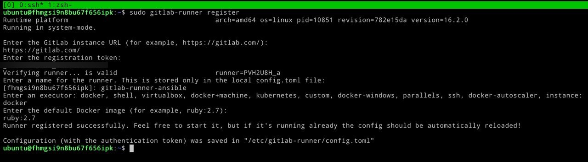
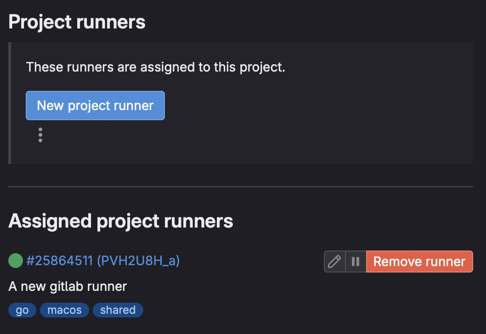

# Requirments
- Ansible
- Terraform 
- Yandex Cloud account
- Yandec Cloud cli (yc)
- GitLab account

# Implementation

### Terraform part
First we need to build cloud infrastructure. For that we need to create the following resources:

- VPC
- IAM 
- Compute Instance

*Note: before running all the commands execute `terraform init` in terraform folder*

Setup for that resources in terraform shown down below:

IAM
```hcl 
resource "yandex_iam_service_account" "gitlab-sa" {
  name        = "gitlab-runner-service-account"
  description = "A separate sa for managing gitlab runners"
}

resource "yandex_iam_service_account_iam_binding" "gitlab-sa-binding" {
  service_account_id = yandex_iam_service_account.gitlab-sa.id
  role               = "compute.admin"

  members = [
    "serviceAccount:${yandex_iam_service_account.gitlab-sa.id}"
  ]
}
```

VPC
```hcl 
resource "yandex_vpc_network" "gitlab-runner-vpc" {
  name        = "gitlab-runner-vpc"
  description = "VPC for gitlab-runner vm instance"
}

resource "yandex_vpc_subnet" "gitlab-runner-vpc-subnet" {
  name           = "gitlab-runner-vpc-subnet"
  description    = "Subnet for gitlab-runner instance"
  v4_cidr_blocks = ["10.2.0.0/16"]
  zone           = var.zone
  network_id     = yandex_vpc_network.gitlab-runner-vpc.id
}
```

And finally compute instance with `nat_ip_address` output
```hcl 
resource "yandex_compute_instance" "default" {
  name               = "gitlab-runner-${uuid()}"
  service_account_id = yandex_iam_service_account.gitlab-sa.id
  description        = "Instance for self-hosted gitlab-runner"
  zone               = var.zone

  resources {
    cores  = 2
    memory = 4
  }

  network_interface {
    subnet_id = yandex_vpc_subnet.gitlab-runner-vpc-subnet.id
    nat       = true
  }

  metadata = {
    ssh-keys = "ubuntu:${file("~/.ssh/id_rsa.pub")}"
  }

  boot_disk {
    initialize_params {
      image_id    = var.image-id
      size        = 30
      description = "Ubuntu 22:04 boot os"
    }
  }
}

data "yandex_compute_instance" "gitlab-runner-vm" {
  instance_id = yandex_compute_instance.default.id
}

output "gitlab-runner-vm-external-ip" {
  value = data.yandex_compute_instance.gitlab-runner-vm.network_interface.0.nat_ip_address
}
```

Now we can apply this configuration by using `terraform apply` (NOTE: for succesfully running you need 3 required vars such as: `cloud-id`, `folder-id`, `token`. For obtaining and generating it I've provide a guide in each variable `description` field)


After hitting `Enter` we can inspect out infrasstructure code and if it seems good type `yes` in prompt field and click `Enter`.



In output you should copy the `nat_ip_address` and move to the ansible part.



### Ansible part

You need to place that address in `hosts` file in ansible directory


Now we can test the connection to our server by running `ansible -i hosts -m ping all`



So by running `ansible-playbook` command it will do this:

- Installing Docker gpg key
- Adding repository for Docker
- Installing Docker from deb repository
- Creating new user `gitlab-runner` and adding it in Docker group
- Downloading gitlab runner sh script into `/tmp/gitlab-runner-setup.sh` and gives it `755` permissions
- Execute `gitlab-runner-setup.sh` script using bash
- Installing `gitlab-runner` binary using apt

For obtaining this creds let's jump into GitLab website and register a new runner (create a new empty repo and go to the **Settings > CI/CD > Runners > New project runner**)

In order to create a new runner give it a tags and description and click `Create runner` as shown down below



Now we can copy our registration token



Then execute `ansible-playbook -i hosts playbook.yml`

The output should be like this:



Now ssh to the our server and register a new runner



Finally our gitlab-runner is up and running



Thanks for reading!